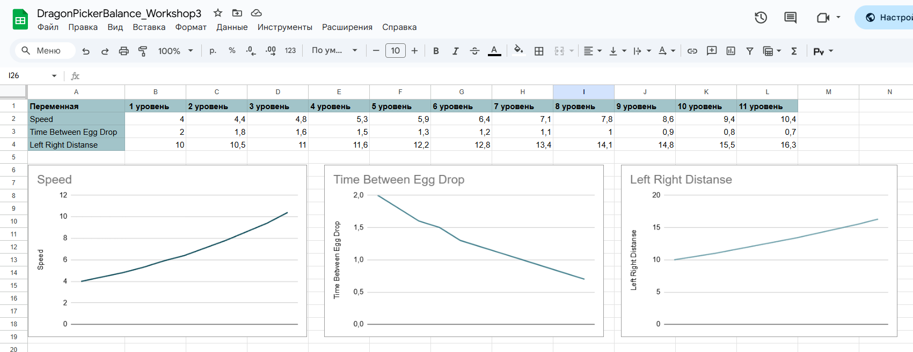

# АНАЛИЗ ДАННЫХ И ИСКУССТВЕННЫЙ ИНТЕЛЛЕКТ [in GameDev]
Отчет по лабораторной работе #1 выполнил(а):
- Ишбаева Кира Миграновна
- РИ230912
Отметка о выполнении заданий (заполняется студентом):

| Задание | Выполнение | Баллы |
| ------ | ------ | ------ |
| Задание 1 | * | 60 |
| Задание 2 | * | 20 |
| Задание 3 | * | 20 |

знак "*" - задание выполнено; знак "#" - задание не выполнено;

Работу проверили:
- к.т.н., доцент Денисов Д.В.
- к.э.н., доцент Панов М.А.
- ст. преп., Фадеев В.О.

[](https://nodesource.com/products/nsolid)

[](https://travis-ci.org/joemccann/dillinger)

Структура отчета

- Данные о работе: название работы, фио, группа, выполненные задания.
- Цель работы.
- Задание 1.
- Код реализации выполнения задания. Визуализация результатов выполнения (если применимо).
- Задание 2.
- Код реализации выполнения задания. Визуализация результатов выполнения (если применимо).
- Задание 3.
- Код реализации выполнения задания. Визуализация результатов выполнения (если применимо).
- Выводы.
- ✨Magic ✨

## Цель работы
Попробовать поработать с балансом в играх

## Задание 1
### Предложите вариант изменения найденных переменных для 10 уровней в игре. Визуализируйте изменение уровня сложности в таблице. 

[Google-таблица](https://docs.google.com/spreadsheets/d/1ZV2iGYohyuk1tDYHWW_fU5aDSWaMLVhsakeK2r1QRmo/edit?usp=sharing)

## Задание 2
### Создайте 10 сцен на Unity с изменяющимся уровнем сложности.

Тут будет картинка

## Задание 3
### Решение в 80+ баллов должно визуализировать данные из google-таблицы, и с помощью Python передавать в проект Unity. В Python данные также должны быть визуализированы.

Не уверена что правильно поняла задание, сделала в этой практике как во втором воркшопе и заполнила таблицу с помощью Python
Как передавать данные по уровням не разобралась.

```py

import gspread
import numpy as np
gc = gspread.service_account(filename='dragonpickerbalance-bcaaf2fa88cb.json')
sh = gc.open("DragonPickerBalance_Workshop3")
letters = ['A', 'B', 'C', 'D', 'E', 'F', 'G', 'H', 'I', 'J', 'K', 'L']
speed = 4.0
deltaSpeed = 1.1
time = 2.0
deltaTime = 0.9
distance = 10.0
deltaDistance = 1.05
i = 0

def newValue(a, delta):
  a = a*delta
  a = round(a, 1)
  a = str(a)
  return a.replace('.',',')
    
while i < len(letters)-1:
    i += 1
    if i == 0 or i == 1:
        continue
    else:
        speedNew = newValue(speed, deltaSpeed)
        speed = speed*deltaSpeed
        timeNew = newValue(time, deltaTime)
        time = time*deltaTime
        distanceNew = newValue(distance, deltaDistance)
        distance = distance*deltaDistance
        sh.sheet1.update((letters[i] + str(2)), speedNew)
        sh.sheet1.update((letters[i] + str(3)), timeNew)
        sh.sheet1.update((letters[i] + str(4)), distanceNew)
        print(speedNew)

```

## Выводы

Абзац умных слов о том, что в ходе работы я узнала о способах настройки баланса в играх и попробовала сделать 10 уровней с постепенно нарастающей сложностью.

| Plugin | README |
| ------ | ------ |
| Dropbox | [plugins/dropbox/README.md][PlDb] |
| GitHub | [plugins/github/README.md][PlGh] |
| Google Drive | [plugins/googledrive/README.md][PlGd] |
| OneDrive | [plugins/onedrive/README.md][PlOd] |
| Medium | [plugins/medium/README.md][PlMe] |
| Google Analytics | [plugins/googleanalytics/README.md][PlGa] |

## Powered by

**BigDigital Team: Denisov | Fadeev | Panov**
