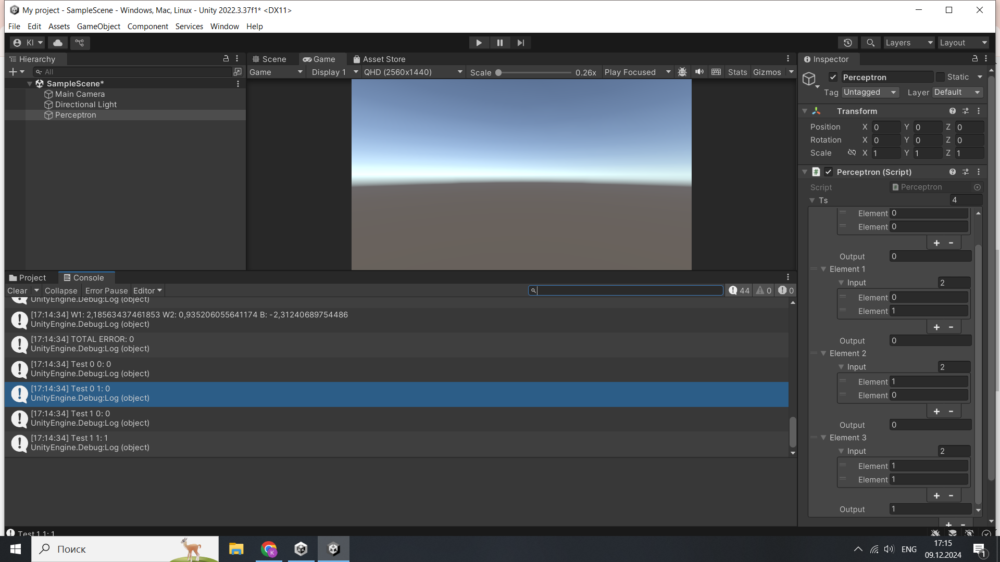
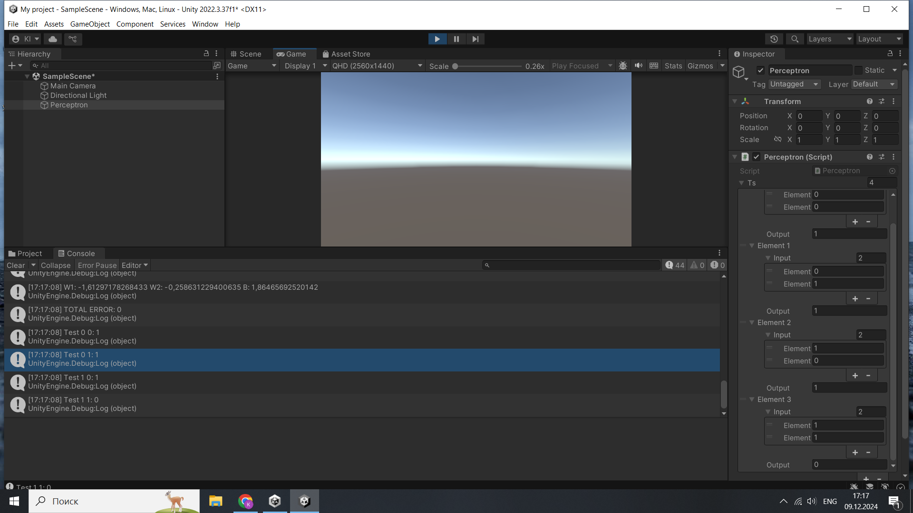
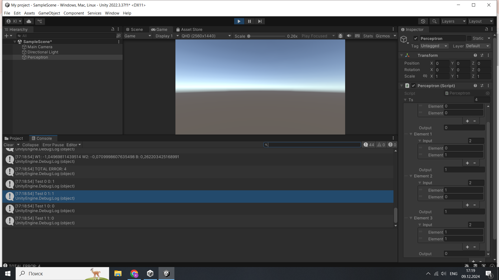
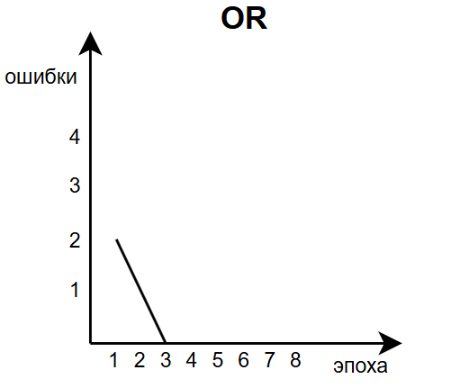
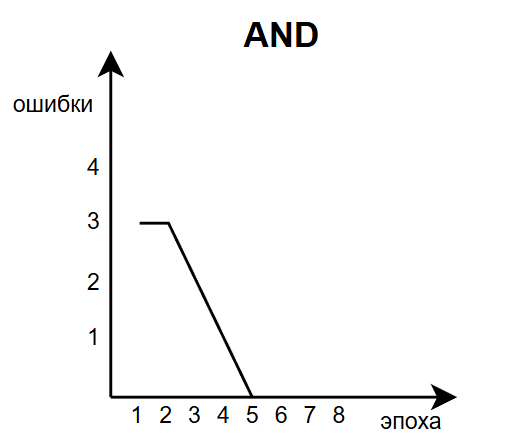
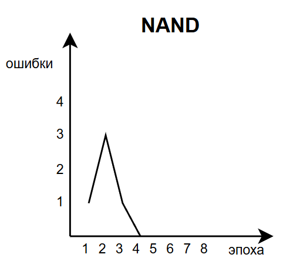
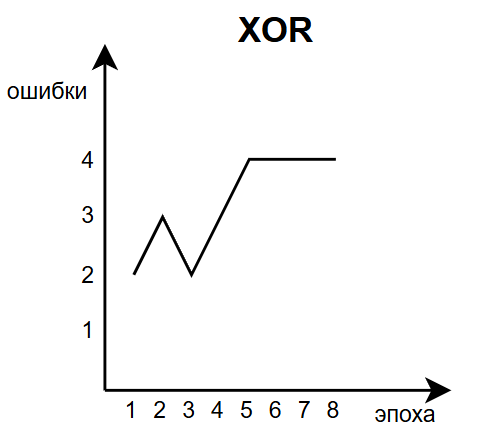

# АНАЛИЗ ДАННЫХ И ИСКУССТВЕННЫЙ ИНТЕЛЛЕКТ [in GameDev]
Отчет по лабораторной работе #4 выполнил(а):
- Ишбаева Кира Миграновна
- РИ230912
Отметка о выполнении заданий (заполняется студентом):

| Задание | Выполнение | Баллы |
| ------ | ------ | ------ |
| Задание 1 | * | 60 |
| Задание 2 | * | 20 |
| Задание 3 | * | 20 |

знак "*" - задание выполнено; знак "#" - задание не выполнено;

Работу проверили:
- к.т.н., доцент Денисов Д.В.
- к.э.н., доцент Панов М.А.
- ст. преп., Фадеев В.О.

Структура отчета

- Данные о работе: название работы, фио, группа, выполненные задания.
- Цель работы.
- Задание 1.
- Код реализации выполнения задания. Визуализация результатов выполнения (если применимо).
- Задание 2.
- Код реализации выполнения задания. Визуализация результатов выполнения (если применимо).
- Задание 3.
- Код реализации выполнения задания. Визуализация результатов выполнения (если применимо).
- Выводы.
- ✨Magic ✨

## Цель работы
Ознакомиться с работой перцептрона

## Задание 1
### В проекте Unity реализовать перцептрон, который умеет производить вычисления: OR, AND, NAND, XOR. Дать комментарии о корректности работы каждого вычисления

#### OR: работает корректно

#### AND: работает корректно

#### NAND: работает корректно

#### XOR: работает некорректно

## Задание 2
### Построить графики зависимости количества эпох от ошибки  обучения. Указать от чего зависит необходимое количество эпох обучения.

ОТ ЧЕГО ЗАВИСИТ???

## Задание 3
### Построить визуальную модель работы перцептрона на сцене Unity.

Картинкииииии

## Выводы

Абзац умных слов о том, что было сделано и что было узнано.

| Plugin | README |
| ------ | ------ |
| Dropbox | [plugins/dropbox/README.md][PlDb] |
| GitHub | [plugins/github/README.md][PlGh] |
| Google Drive | [plugins/googledrive/README.md][PlGd] |
| OneDrive | [plugins/onedrive/README.md][PlOd] |
| Medium | [plugins/medium/README.md][PlMe] |
| Google Analytics | [plugins/googleanalytics/README.md][PlGa] |

## Powered by

**BigDigital Team: Denisov | Fadeev | Panov**
